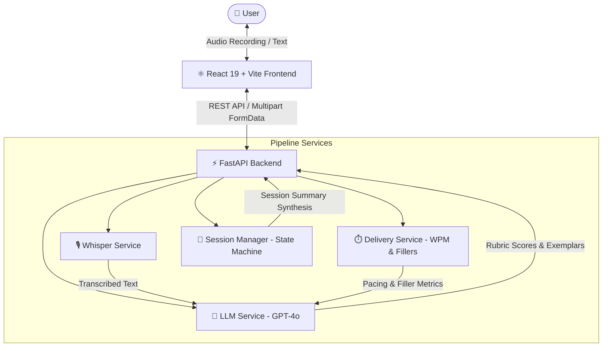

# 🎙️ AI Mock Interview Coach

> An intelligent, voice-powered interview preparation platform. Practice technical architecture and behavioral STAR interviews out loud, receiving instant, multidimensional feedback on both **substance** and **delivery**.

---

## ✨ Features

- **🗣️ Voice-First Practice**: Speak answers out loud with browser-based audio streaming transcribed with high precision via OpenAI Whisper.
- **🎯 Dynamic Question Engine**: Generates non-repeating questions customized by track (*Technical Architecture* or *STAR Behavioral*), role specialization (*Frontend, Backend, System Design, Leadership*), and seniority calibration (*Junior, Mid, Senior/Staff*).
- **📊 Real-Time Multidimensional Feedback**:
  - **Content & Substance**: Evaluated against role-specific rubrics and technical trade-offs.
  - **STAR Behavioral Logic**: Evaluates Situation, Task, Action, and measurable Results.
  - **Vocal Delivery Analytics**: Words-per-minute (WPM) cadence pacing, speech filler word detection (`um`, `like`, `you know`, etc.), and speaking duration.
- **✨ Exemplary Model Rephrase**: AI-generated gold-standard response for every question to illustrate how a senior engineer would structure the answer.
- **📈 End-of-Session Performance Dashboard**: Synthesizes cross-question trends into recurring strengths, growth opportunities, and a concrete focus goal for subsequent practice rounds.
- **🛡️ Resilient Fallback Engine**: Fully functional in demo/offline mode even without active API keys or under upstream rate-limiting.

---

## 🏛️ System Architecture



---

## 🛠️ Tech Stack

| Layer | Technology | Rationale |
|---|---|---|
| **Frontend** | **React 19, TypeScript, Vite, TailwindCSS v4** | Ultra-responsive SPA with Web Audio API recording and zero-latency UI transitions |
| **Icons & Design** | **Lucide Icons, Custom Glassmorphism** | Modern, dark-mode design system with micro-interactions |
| **Backend** | **FastAPI, Python 3.11+, Pydantic v2** | High-performance asynchronous API layer with strict schema enforcement |
| **Speech-to-Text** | **OpenAI Whisper API (`whisper-1`)** | Industry-leading transcription accuracy with technical term recognition |
| **AI Evaluation** | **OpenAI GPT-4o-mini (`gpt-4o-mini`)** | Low latency, structured JSON completions for real-time interview rubrics |
| **Testing** | **Pytest + AnyIO (Backend), Vitest + React Testing Library (Frontend)** | Full-stack automated test coverage across unit, integration, and resilience |

---

## 🚀 Quick Start Guide

### Prerequisites
- **Node.js** (v18+)
- **Python** (v3.10+)
- **OpenAI API Key** *(Optional — fallback mock mode is active when omitted)*

---

### 1. Backend Setup

```bash
# Navigate to backend directory
cd backend

# Create and activate virtual environment
python -m venv venv
# On Windows:
.\venv\Scripts\activate
# On Linux/macOS:
source venv/bin/activate

# Install dependencies
pip install -r requirements.txt

# Configure environment variables
cp .env.example .env

# Verify environment and launch server
python verify_env.py
uvicorn app.main:app --reload --port 8000
```
Backend API will be accessible at: `http://localhost:8000` (API documentation at `http://localhost:8000/docs`).

---

### 2. Frontend Setup

```bash
# Navigate to frontend directory
cd frontend

# Install dependencies
npm install

# Start development server
npm run dev
```
Frontend application will be accessible at: `http://localhost:5173`.

---

## 🧪 Running Automated Tests

Run the complete full-stack test suite with the unified script:

```powershell
# Run both Backend Pytest and Frontend Vitest suites
.\run_all_tests.ps1
```

Or run test suites individually:

```bash
# Backend Pytest (13 test cases)
cd backend
.\venv\Scripts\pytest -v

# Frontend Vitest (7 test cases)
cd frontend
npm test
```

---

## 📐 Interview Evaluation Rubric

Every spoken answer is evaluated across 3 core dimensions (0–100 scale):

1. **Content Score**:
   - Technical accuracy, domain depth, naming specific libraries/tools, addressing scale, and trade-offs.
   - For behavioral questions: adherence to the STAR framework with concrete business impact.
2. **Clarity Score**:
   - Structured communication, logical flow, avoiding ambiguity, and structured reasoning.
3. **Delivery Score**:
   - Optimal conversational pacing (~130–165 WPM).
   - Low frequency of filler phrases (`um`, `uh`, `like`, `you know`, `basically`).
   - Appropriate duration (60–120 seconds target).

---

## 🔒 Security & Privacy

- Audio recordings are processed in-memory as ephemeral byte streams and never permanently stored on disk or in persistent databases.
- Sessions are maintained in in-memory state machines and automatically garbage-collected.
- CORS policies and upload payload boundaries (max 25MB) prevent malformed or oversized requests.

---

## 📄 License

MIT License © 2026 AI Mock Interview Coach.
