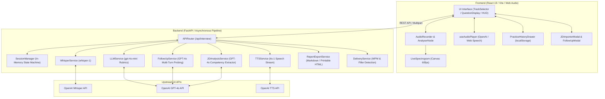
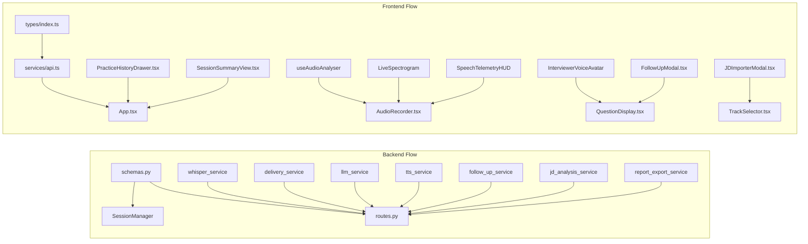

# POISE — Intelligent Voice & STAR Mock Interview Coach

A production-grade, AI-augmented mock interview platform designed for engineering and leadership candidates. Features natural conversational voice playback via OpenAI TTS (`tts-1`) and zero-latency Web Speech API fallback, real-time client-side speech telemetry (Words-Per-Minute cadence, vocal volume meter, pace classification), interactive canvas-rendered visual audio spectrograms, dynamic multi-turn follow-up and probing drill-downs (Shallow, Medium, Deep), custom Job Description ingestion and tech competency extraction via GPT-4o, exportable Markdown and printable PDF reports with comprehensive STAR rubrics, and a localized practice history & score trajectory drawer.

---

## Features

### Core Functionality
- **Voice-First Interview Simulator**: Speak answers out loud in real time with browser-based audio streaming transcribed with high precision via OpenAI Whisper (`whisper-1`).
- **Dynamic Question Engine**: Generates non-repeating, role-specific questions tailored by track (*Technical Architecture* or *STAR Behavioral*), specialization (*Frontend, Backend, Distributed Systems, Leadership*), and seniority calibration (*Junior, Mid, Senior/Staff*).
- **Multidimensional AI Evaluation**:
  - **Content & Technical Substance**: Evaluated against role-specific rubrics, trade-off awareness, and architectural edge cases.
  - **STAR Behavioral Logic**: Scores Situation, Task, Action, and measurable Results with ownership validation.
  - **Clarity & Logic Flow**: Quantifies structure, conciseness, and articulation.
  - **Delivery & Vocal Composure**: Measures pacing, fluency, and emotional steadiness.
- **Vocal Delivery Analytics**: Automated Words-Per-Minute (WPM) detection, sentence density metrics, and speech filler word identification (`um`, `uh`, `like`, `you know`, `actually`, `basically`, `sort of`).
- **Exemplary Model Rephrase**: AI-generated gold-standard snippet for every question demonstrating how a top candidate would structure and articulate the response.
- **Executive Performance Dashboard**: Synthesizes cross-question trends into recurring strengths, growth opportunities, and a concrete focus goal for subsequent practice rounds.

### Advanced Features
- **Interactive AI Voice Interviewer (TTS)**: Realistic audio playback of interview questions using OpenAI's `tts-1` model (`nova` voice) with sub-second streaming responses.
- **Zero-Latency Browser Speech Fallback**: Graceful degradation to browser-native `window.speechSynthesis` when offline or operating without OpenAI credentials.
- **Interviewer Voice Avatar**: Animated voice avatar strip with pulsing acoustic rings and active speaking equalizer waveforms.
- **Real-Time Audio Analyser & Visual Spectrogram**: Browser-based Web Audio `AnalyserNode` with 128-bin FFT frequency analysis, rendering violet-gradient audio bars with smooth attack/decay algorithms.
- **Live Speech Telemetry HUD**: Real-time Heads-Up Display showing dynamic WPM calculation, multi-segment volume level meter, and instant pace classification (`too_slow`, `good`, `optimal`, `a_bit_fast`, `too_fast`).
- **Dynamic Multi-Turn Follow-Up & Probing Engine**: Context-aware interviewer drill-downs targeting what the candidate actually said in their previous transcript. Features 3 selectable probing depths:
  - `Clarify & Expand (Shallow)`: Deepens concrete examples and articulates specific details.
  - `Challenge Trade-Offs (Medium)`: Defends architectural choices and alternative approaches.
  - `Stress-Test Edge Cases (Deep)`: Tests recovery from system failures, scale bottlenecks, and unexpected constraints.
- **Target Answer Direction (Hint Preview)**: View target answer expectations and reasoning context before answering follow-up questions.
- **Custom Interview Architect & JD Ingestion**: Paste any raw Job Description (from Stripe, Netflix, Google, etc.) to extract primary technologies, architectural domains, and seniority expectations via GPT-4o.
- **Bespoke Question Ingestion & Session Queue**: Automatically compiles customized question sequences directly from JD requirements and registers them into the active practice session state machine.
- **Exportable Markdown Reports**: Generates structured `.md` files containing executive performance summaries, metric tables, and full question-by-question breakdowns with transcripts.
- **Printable PDF Reports**: Synthesizes standalone, self-contained HTML reports styled specifically for clean browser printing (`window.print()`) to PDF.
- **Practice History & Trend Tracker**: Local storage persistence (`localStorage`) recording past session scores, tracks, and average WPM trajectories.
- **Practice History Drawer**: Slide-over drawer to review historical sessions, track score trajectories, and relaunch practice loops.

### Resilience & Privacy
- **In-Memory Audio Processing**: Voice recordings are processed in-memory and discarded immediately after transcription — zero persistent server-side audio storage.
- **Graceful Procedural Fallback Engine**: Fully functional in offline/demo mode with procedural question generators, rule-based delivery heuristics, and static answer evaluations if external APIs are unavailable.
- **Deterministic Question Banks**: Curated catalog of technical and behavioral questions used to guarantee zero downtime during upstream rate-limiting.

---

## Tech Stack

### Backend
- **FastAPI** (Python 3.11+) — Asynchronous, high-performance ASGI web framework.
- **Pydantic v2** — Strict schema validation, serialization, and typing.
- **OpenAI Whisper API (`whisper-1`)** — High-accuracy speech-to-text audio transcription.
- **OpenAI GPT-4o / GPT-4o-mini** — Structured JSON prompt completions for question generation, multi-turn follow-ups, JD extraction, and feedback rubrics.
- **OpenAI TTS API (`tts-1`)** — High-fidelity text-to-speech audio synthesis.
- **Uvicorn** — Lightning-fast ASGI web server implementation.
- **Pytest & AnyIO** — Comprehensive backend unit, integration, and resilience test suite.

### Frontend
- **React 19** with **TypeScript** — Component architecture with modern hooks and strict typing.
- **Vite** — Ultra-fast frontend build tooling and HMR dev server.
- **Tailwind CSS v4** — High-performance modern utility styling with custom design tokens.
- **Web Audio API (`AudioContext`, `AnalyserNode`, `MediaStream`)** — Real-time frequency analysis and volume metering.
- **Web Speech API (`SpeechSynthesis`)** — Zero-latency browser-native text-to-speech fallback.
- **Lucide React** — Consistent iconography system.
- **Vitest & React Testing Library** — Unit and integration component testing suite.

---

## System Architecture

The system operates on an asynchronous, decoupled client-server architecture with in-memory streaming pipelines:



---

## Module Dependency



---

## Project Structure

```
AI Mock Interview Coach/
├── backend/
│   ├── app/
│   │   ├── api/
│   │   │   └── routes.py              # Centralized FastAPI endpoints
│   │   ├── core/
│   │   │   └── config.py              # Environment settings & Pydantic config
│   │   ├── models/
│   │   │   └── schemas.py             # Pydantic data schemas & request/response types
│   │   ├── services/
│   │   │   ├── delivery_service.py    # WPM pacing heuristics & filler word detection
│   │   │   ├── follow_up_service.py   # Multi-turn probing & depth-calibrated follow-ups
│   │   │   ├── jd_analysis_service.py # Job Description parser & custom question generator
│   │   │   ├── llm_service.py         # GPT-4o question generation & answer rubric evaluations
│   │   │   ├── report_export_service.py # Markdown & printable HTML report synthesis
│   │   │   ├── session_manager.py     # In-memory interview session state machine
│   │   │   ├── tts_service.py         # OpenAI TTS audio stream generation
│   │   │   └── whisper_service.py     # Whisper audio transcription & fallback
│   │   └── main.py                    # FastAPI application initialization & CORS
│   ├── tests/
│   │   ├── test_delivery_and_feedback.py
│   │   ├── test_follow_up.py          # Unit tests for multi-turn follow-up engine
│   │   ├── test_jd_analysis.py        # Unit tests for JD ingestion & custom sessions
│   │   ├── test_pipeline_mocks_and_resilience.py
│   │   ├── test_question_gen.py
│   │   ├── test_report_export.py      # Unit tests for Markdown & HTML report export
│   │   ├── test_session_lifecycle.py
│   │   ├── test_telemetry.py          # Unit tests for speech telemetry endpoint
│   │   ├── test_tts_service.py        # Unit tests for TTS synthesis & fallback
│   │   └── test_whisper_transcription.py
│   ├── requirements.txt
│   └── verify_env.py                  # Environment verification utility
├── frontend/
│   ├── src/
│   │   ├── components/
│   │   │   ├── history/
│   │   │   │   └── PracticeHistoryDrawer.tsx # Session history & score trajectory drawer
│   │   │   ├── interview/
│   │   │   │   ├── AudioRecorder.tsx         # MediaRecorder & audio telemetry container
│   │   │   │   ├── FeedbackCard.tsx          # Real-time multidimensional feedback card
│   │   │   │   ├── FollowUpModal.tsx         # Dynamic probing drill-down modal
│   │   │   │   ├── InterviewerVoiceAvatar.tsx # Speaking avatar & audio controls
│   │   │   │   ├── LiveSpectrogram.tsx       # Canvas 60fps audio frequency visualizer
│   │   │   │   ├── QuestionDisplay.tsx       # Active question orchestration container
│   │   │   │   └── SpeechTelemetryHUD.tsx    # Volume meter, WPM counter, & pace badge
│   │   │   ├── setup/
│   │   │   │   ├── JDImporterModal.tsx       # Job Description paste & customization modal
│   │   │   │   └── TrackSelector.tsx         # Track, role, level, & JD selection screen
│   │   │   └── summary/
│   │   │       └── SessionSummaryView.tsx    # Performance dashboard & export actions
│   │   ├── hooks/
│   │   │   ├── useAudioAnalyser.ts           # Web Audio AnalyserNode & volume meter hook
│   │   │   ├── useAudioPlayer.ts             # OpenAI TTS & Web Speech fallback hook
│   │   │   └── useAudioRecorder.ts           # MediaRecorder & stream capture hook
│   │   ├── services/
│   │   │   └── api.ts                        # Frontend API client & download triggers
│   │   ├── test/
│   │   │   ├── FeedbackCard.test.tsx
│   │   │   ├── FollowUpModal.test.tsx
│   │   │   ├── InterviewerVoiceAvatar.test.tsx
│   │   │   ├── JDImporterModal.test.tsx
│   │   │   ├── PracticeHistoryDrawer.test.tsx
│   │   │   ├── SessionSummaryView.test.tsx
│   │   │   └── useAudioPlayer.test.ts
│   │   ├── types/
│   │   │   └── index.ts                      # TypeScript definitions & API models
│   │   ├── App.tsx                           # Main application coordinator
│   │   ├── index.css                         # Custom design system & animations
│   │   └── main.tsx                          # Application entry point
│   ├── package.json
│   └── vite.config.ts
├── run_all_tests.ps1                          # Full-stack automated test runner
└── README.md
```

---

## API Documentation Overview

The backend exposes a RESTful API under `/api/interview`:

*   **Tracks & Roles**: `GET /api/interview/tracks` — Retrieves all tracks, role specializations, and seniority calibrations.
*   **Start Session**: `POST /api/interview/start` — Initializes a practice session with dynamic question generation.
*   **Custom JD Session**: `POST /api/interview/custom-jd` — Ingests a raw job description, extracts competencies, and starts a bespoke session.
*   **Next Question**: `POST /api/interview/next-question` — Advances to the next question in the session or custom JD queue.
*   **Audio Transcription**: `POST /api/interview/transcribe` — Receives multipart audio (`audio/webm`) and returns Whisper transcription.
*   **Submit Answer**: `POST /api/interview/submit-answer` — Submits audio or text for multidimensional evaluation.
*   **Speech Telemetry**: `POST /api/interview/telemetry` — Submits live client-side WPM/volume and returns real-time coaching tips.
*   **Multi-Turn Follow-Up**: `POST /api/interview/follow-up` — Generates a contextual probe question calibrated by depth (`shallow`, `medium`, `deep`).
*   **Text-to-Speech (TTS)**: `POST /api/interview/tts` — Synthesizes OpenAI `tts-1` audio stream for interviewer voice.
*   **End Session Summary**: `POST /api/interview/end` — Concludes the session and synthesizes the cross-question performance dashboard.
*   **Export Report**: `POST /api/interview/report/export` — Synthesizes exportable Markdown, standalone printable HTML, or JSON.

---

## Performance Benchmarks

### Transcription & Audio Processing
- **Whisper API Transcription**: ~1.2–1.8s response time for 60-second audio answers.
- **Client-Side Spectrogram Rendering**: 60fps hardware-accelerated Canvas rendering with `< 2%` CPU overhead.
- **Audio Analyser Latency**: Zero-latency Web Audio `AnalyserNode` frequency bin calculations running directly in the browser thread.

### Feedback & AI Synthesis
- **Evaluation Turnaround**: ~1.5–2.5s with structured JSON completions from `gpt-4o-mini`.
- **Procedural Offline Fallback**: `< 15ms` instant evaluation turnaround when external APIs are offline.
- **Text-to-Speech Streaming**: Sub-second initial chunk playback with automatic instant fallback to browser Web Speech API.

---

## Quick Start Guide

### Prerequisites
- **Node.js** (v18.0+)
- **Python** (v3.10+)
- **OpenAI API Key** *(Optional — full procedural fallback activates automatically when omitted)*

---

### 1. Backend Setup

```bash
# Navigate to backend directory
cd backend

# Create and activate virtual environment
python -m venv venv

# On Windows:
.\venv\Scripts\activate
# On macOS / Linux:
source venv/bin/activate

# Install dependencies
pip install -r requirements.txt

# Configure environment variables in .env
# OPENAI_API_KEY=your_key_here

# Verify environment and launch server
python verify_env.py
uvicorn app.main:app --reload --port 8000
```
Backend API will be running at `http://localhost:8000` (Interactive Swagger docs available at `http://localhost:8000/docs`).

---

### 2. Frontend Setup

```bash
# Navigate to frontend directory
cd frontend

# Install dependencies
npm install

# Start development server
npm run dev
```
Frontend web application will be running at `http://localhost:5173`.

---

### 3. Running Automated Tests

To execute the complete full-stack automated test suite (38 backend tests + 33 frontend tests):

```powershell
# Run all tests using the PowerShell script
.\run_all_tests.ps1
```

Or run each suite individually:

```bash
# Backend pytest suite (38 tests)
cd backend
python -m pytest tests/ -v

# Frontend Vitest suite (33 tests)
cd frontend
npm test
```

---

## License

MIT License © 2026 POISE. Built for engineers, engineering leaders, and candidates worldwide.
