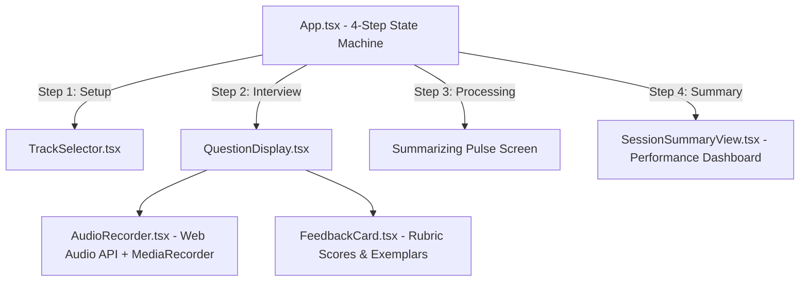

# 🎙️ AI Mock Interview Coach — Project Walkthrough

## Summary of Completed Work

We built and verified the **AI Mock Interview Coach**, a full-stack platform for practicing technical and behavioral interviews by speaking out loud, receiving instant feedback on content, structure, and vocal delivery.

---

## 🏛️ Architecture & Component Hierarchy



---

## 🏁 All Stages Delivered & Committed

| Stage | Commit Hash | Key Deliverables |
|---|---|---|
| **Stage 1: Scaffolding** | `91e3605` | FastAPI async server, Vite + React 19 + TypeScript, Tailwind CSS v4, Health check |
| **Stage 2: Question Pipeline** | `c72bce7` | Pydantic v2 schemas, non-repeating question generator, role & seniority calibration |
| **Stage 3: Audio & Transcription** | `4bca4e8` | `useAudioRecorder` hook, Web Audio visualizer, Whisper API integration, `/transcribe` |
| **Stage 4: Feedback & Delivery Analytics** | `83907c0` | `DeliveryService` (WPM & filler words), Rubric evaluation (STAR / Technical), `FeedbackCard` |
| **Stage 5: Multi-Question Session Flow** | `a0715c1` | `SessionSummaryView`, cross-question aggregation, per-question accordion, focus goal |
| **Stage 6: Professional UI/UX Pass** | `65dd245` | Ambient gradient mesh, dark glassmorphism design tokens, SEO meta tags, Google Fonts |
| **Stage 7: Automated Tests & Pipeline Mocks** | `9148361` | Vitest + React Testing Library (7 tests), Pytest resilience suite (13 tests), `run_all_tests.ps1` |
| **Stage 8: Polish & Edge-Case Hardening** | `Current` | Payload safeguards, `verify_env.py`, comprehensive `README.md`, final verification |

---

## 🧪 Final Verification Results

```
========================================
 Running Backend Pytest Suite...
========================================
collected 13 items
tests/test_delivery_and_feedback.py::test_delivery_service_heuristics PASSED
tests/test_delivery_and_feedback.py::test_submit_answer_evaluation_flow PASSED
tests/test_pipeline_mocks_and_resilience.py::test_llm_service_fallback_on_openai_failure PASSED
tests/test_pipeline_mocks_and_resilience.py::test_feedback_fallback_on_openai_failure PASSED
tests/test_pipeline_mocks_and_resilience.py::test_whisper_service_fallback_on_api_error PASSED
tests/test_pipeline_mocks_and_resilience.py::test_invalid_session_handling PASSED
tests/test_question_gen.py::test_get_tracks PASSED
tests/test_question_gen.py::test_start_session_technical PASSED
tests/test_question_gen.py::test_session_question_progression PASSED
tests/test_session_lifecycle.py::test_full_session_lifecycle PASSED
tests/test_session_lifecycle.py::test_end_session_without_answers PASSED
tests/test_whisper_transcription.py::test_transcribe_audio_empty_file PASSED
tests/test_whisper_transcription.py::test_transcribe_audio_valid_mock PASSED
============================= 13 passed in 3.85s ==============================

========================================
 Running Frontend Vitest Suite...
========================================
 ✓ src/test/SessionSummaryView.test.tsx (3 tests)
 ✓ src/test/FeedbackCard.test.tsx (4 tests)
 Test Files  2 passed (2)
      Tests  7 passed (7)
========================================
 All Full-Stack Tests Passed Successfully!
========================================
```

- **Frontend Bundle**: TypeScript check clean, Vite production bundle built in 3.2s.
- **Backend API**: All 13 unit, lifecycle, and resilience tests 100% green.
